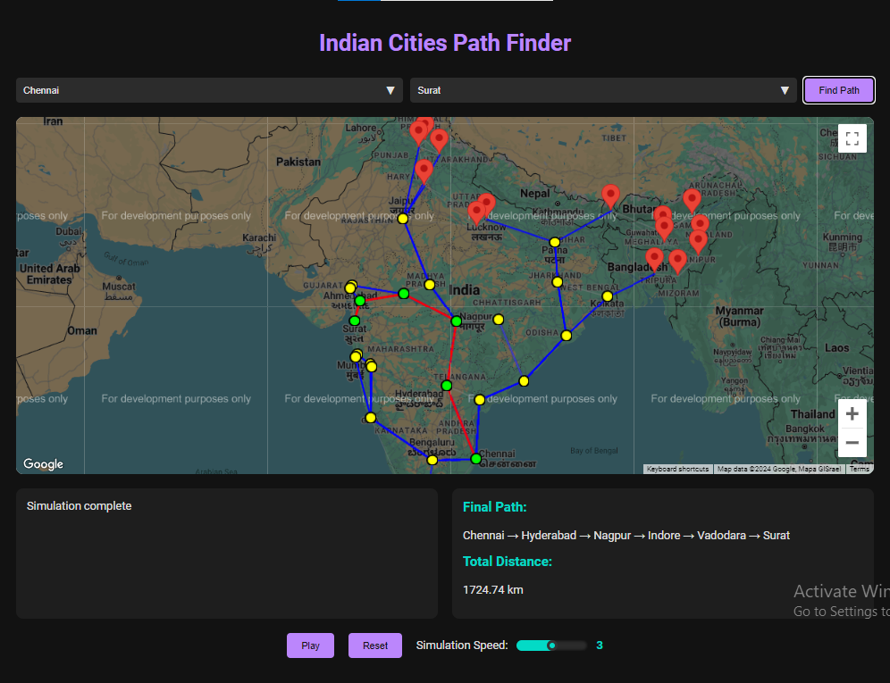

# Dijkstra's Algorithm Visualizer

This project implements an interactive map that allows users to visualize Dijkstra's algorithm for finding the shortest path between selected cities. It also displays the shortest distance between the chosen cities and the length of the path, where each city can only reach to its 3 closest cities.



## Table of Contents


## Demo

Check out the live demo of the interactive map here: [Dijkstras Algorithm Visualizer](https://rishwanthvallala.github.io/Dijkstras_algo_visualiser/)


## Requiements

- **Java**: JDK 11 or later for running the Spring Boot application.
- **Maven**: For building and managing the Spring Boot project dependencies.
- **Google Maps API Key**: Required for the map interface to function.


## Getting Started

To set up the project locally, follow these steps:

1. Clone the repository:
   ```sh
   git clone https://github.com/rishwanthvallala/Dijkstras_algo_visualiser.git
   cd Dijkstras_algo_visualiser
   ```

2. Install dependencies and build the project:
   ```sh
   ./mvn clean install
   ```

3. Run the Spring Boot application:
   ```sh
   ./mvn spring-boot:run
   ```

4. Open the `localhost:8080` in a web browser to run the interactive map.


## Customization

You can customize the project in the following ways:

- Modify city data in the `/cities` API in the `src/main/java/com/example/demo/DijkstrasController.java` to add or remove cities.
- Adjust the algorithm parameters in the backend Spring Boot code for different pathfinding requirements.
- Update the map initialization options in the `src/main/java/com/example/demo/resources/templates/script.js` file to change the initial map center and zoom level.


## Contributing

Contributions to this project are welcome! If you have any suggestions, improvements, or bug fixes, please open an issue or a pull request.

---

Feel free to make any additional changes based on your project's specific needs!